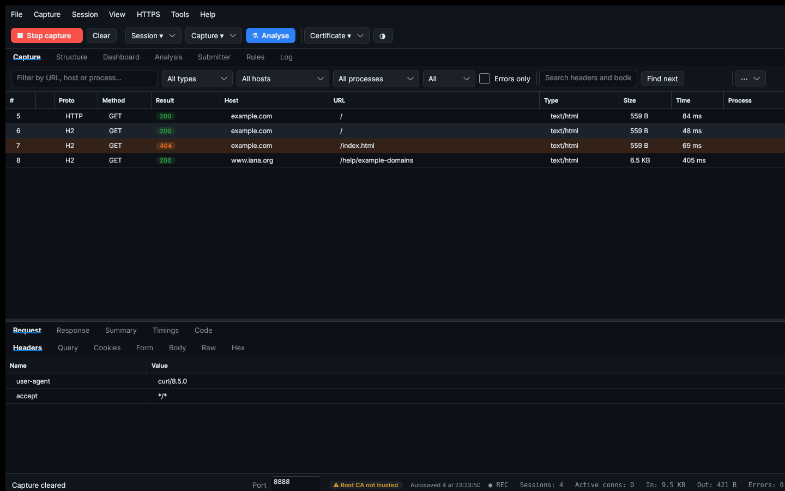
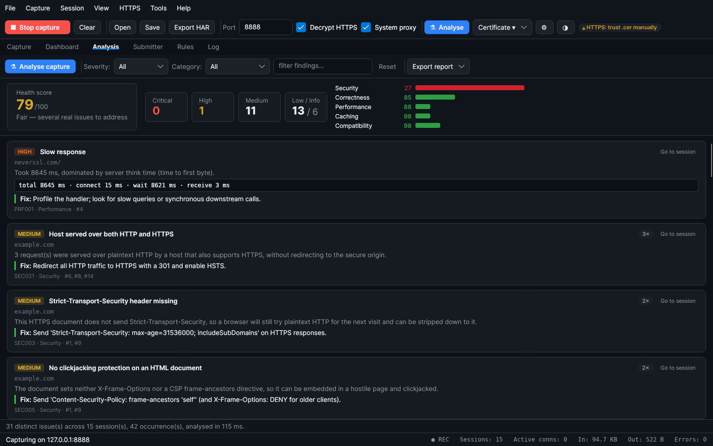
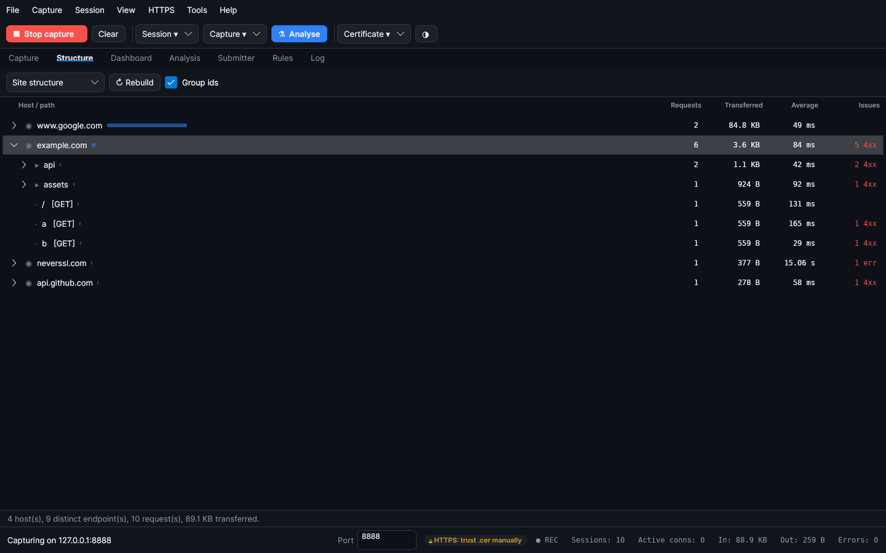

# HttpSpy

A Windows desktop HTTP/HTTPS debugger — a feature-parity analog of HTTP Debugger.

HttpSpy captures, decrypts, inspects, modifies and replays HTTP/HTTPS traffic
through a built-in man-in-the-middle proxy. It is written in **C# / .NET 8** with
an **Avalonia** UI, so the exact same codebase builds a native Windows `.exe`
and can be developed and demoed on Linux/macOS.



*Live capture: HTTP/1.1 and HTTP/2 side by side, status-coded rows tinted by the
default highlight rules, quick filters for type/host/process, and the decrypted
response inspected below.*

## Features

- **Live capture** of HTTP and HTTPS traffic with a real-time session grid
  (index, protocol, method, result, host, URL, content-type, size, time, process).
- **HTTPS decryption** via an auto-generated root CA and per-host leaf
  certificates (issued on the fly, cached under `%APPDATA%\HttpSpy`).
- **System proxy integration** on Windows — capture starts intercepting
  immediately (WinINET registry + `InternetSetOption` refresh). On other
  platforms, point your client at `127.0.0.1:8888`.
- **Process attribution** on Windows via the IP Helper API (`GetExtendedTcpTable`).
- **Inspectors:** request/response headers, query string, cookies, form fields,
  body (with JSON/XML pretty-printing), raw view, hex dump, image preview, and
  per-phase timings.
- **Protocols:** HTTP/1.1 (full), **HTTP/2** (ALPN `h2`, full HPACK + frame
  layer, stream multiplexing, flow control), **gRPC** decoding (length-prefixed
  protobuf), WebSocket frame capture (RFC 6455), Server-Sent Events
  (text/event-stream). HTTPS via MITM.
- **Submitter** (request builder): compose any request or clone a captured one,
  edit method/URL/headers/body, and resend.
- **Rules engine:** Block, Redirect, Auto-Reply (mock responses), Breakpoints
  (pause + edit request/response live), Modify request/response, Delay,
  Highlight, and **Map Local** (serve a local file as the response, with
  automatic MIME-type detection) — matched by Contains / Wildcard / Regex / Exact.
- **Network simulation (throttling):** rate-limit downstream bandwidth (kbps)
  and inject extra latency (ms) to emulate slow links, with one-click presets
  (GPRS / 2G / 3G / DSL / Wi-Fi) in the Options dialog.
- **Dashboard:** status-code distribution, top hosts, content types and method
  breakdown, plus totals (requests, bytes, average time, errors, HTTPS count).
- **Structure tree:** the whole capture folded into a host → path hierarchy,
  with per-branch request counts, transferred bytes, average timing and error
  tallies; identifier-shaped path segments collapse so a REST API reads as
  `/users/{id}` instead of a thousand leaves.
- **Connection view:** transactions grouped by the transport connection that
  carried them, distinguishing genuine HTTP/2 multiplexing (overlapping streams)
  from ordinary keep-alive reuse.
- **Quick filters:** content-type class (data / page assets / streaming), host
  and originating process, populated live from the capture.
- **Capture filters:** rules that stop a transaction being *recorded* at all —
  unlike display filters, ignored traffic costs no memory, which is what makes a
  long unattended capture practical.
- **Traffic analysis:** a one-click audit of the whole capture — 40+ checks
  across security, privacy, performance, caching, correctness, compatibility
  and API design — with a 0–100 health score, per-category scores, deduplicated
  findings, the evidence that triggered each one, and the fix. See below.
- **Code generation** from any session: cURL, C#, Python, JavaScript,
  PowerShell and `.http` (VS Code REST Client / JetBrains HTTP client).
- **Portable configuration:** export and import options, rules and filters as a
  single JSON bundle, so a working setup can be shared or committed.
- **Export / persistence:** HAR 1.2, CSV (Excel), and a compressed `.hspy`
  session file (save/restore full captures including bodies, per-phase timings,
  WebSocket frames and SSE events).
- **Import**: a HAR 1.2 log from browser devtools, a cURL command from the
  clipboard (all four quoting styles browsers emit), or a `.http` request file.
  Imported traffic feeds the analyzer, the structure tree and the dashboard just
  like a live capture, so a trace captured elsewhere can be inspected here.

### Pro-level workflow features

- **Sortable, filterable session grid** — click any column header to sort;
  filter by URL / host / method / status / process, "errors only", or
  full-text **search inside request/response bodies**.
- **JSON tree viewer** — responses detected as JSON get a collapsible,
  type-annotated tree alongside the pretty-printed body.
- **Timing waterfall** — per-transaction Connect / Send / Wait / Receive phase
  bars with a millisecond breakdown.
- **Find bar** — incremental "find next" search (with match count) inside the
  response body.
- **Session compare** — pick a baseline, then compare any other session against
  it in a side-by-side line diff (removed lines tinted red, added green).
- **Context menu** on the grid: resend in Submitter, copy URL / cURL, copy or
  save the response body, bookmark, mark/compare, delete.
- **Colour-coded grid** — status-class pills (2xx/3xx/4xx/5xx), row tinting from
  highlight rules, bookmark markers, and per-row flags for replayed, truncated
  and annotated transactions. Errors, slow responses and oversized payloads are
  highlighted out of the box.
- **Optional columns** — transfer speed, the server IP that actually answered
  (useful behind a load balancer) and the connection/stream the transaction used.
- **Auto-scroll** to follow live capture, **dark / light theme toggle** (both
  built from the same design tokens, so neither is an afterthought), and an
  **upstream proxy + TLS-passthrough host** configuration.
- **Bounded by design** — capped buffered bodies, a session retention limit that
  never evicts bookmarked or selected rows, capped WebSocket/SSE retention, and
  a coalesced grid refresh, so a long unattended capture stays responsive.
- **Search everything** (Ctrl+Shift+F) — full-text search across every captured
  transaction's URLs, headers, bodies and WebSocket/SSE messages, with regex,
  match-case and whole-word; results list the matching line and jump to the
  transaction. Long lines are trimmed around the match, so a minified bundle on
  one 400 KB line stays readable.
- **Autosave and crash recovery** — the live capture is snapshotted periodically
  and offered back on the next start after an unclean exit. A marker file tells a
  crash from a deliberate close, so a normal shutdown never nags.
- **Network simulation that actually applies** — one shared bandwidth budget
  paces HTTP/1.1, HTTP/2, WebSocket, SSE and opaque CONNECT tunnels alike, with
  latency injected once per response.
- **Bounded memory for large bodies** — bodies above a threshold are spilled to
  a temporary file and read back on demand, so an overnight capture of large
  responses cannot exhaust the heap. Spill files are released with the session.
- **English and Russian interface** — switchable at runtime from
  *Tools ▸ Options ▸ Language*, defaulting to the system language.
- **Persistent settings & rules** — all options, the theme, the language and the
  rule list are saved to `%APPDATA%\HttpSpy\` (`settings.json` + `rules.json`)
  and restored on the next launch.

### HTTP Debugger-parity features

- **Regex HTTP Modifier** — per-rule find/replace over request/response headers
  *and* bodies, with capture-group substitution (`$1`, `$2`), escape sequences
  (`\r \n \t`), and automatic `Content-Length` recalculation. Multiple modifier
  steps can be chained on a single rule.
- **Endpoint redirect (TCP/IP Redirector)** — transparently remap a matched
  request to a different `host:port`, with an optional `Host:` header rewrite,
  while the client URL stays unchanged.
- **Highlighting engine** — colour grid rows by *column + operator* rules
  (Contains / IsSame / StartsWith / EndsWith / IsEqual / IsLess / IsBigger /
  IsBetween over URL, host, method, status, content-type, process, sizes,
  duration, speed) or by regex match on any header.
- **Conditional bookmarks** — auto-bookmark sessions whose headers match a regex,
  with optional comment, and a "⮕ Bookmark" navigation button.
- **Advanced global search** — search across URL, request/response headers and
  bodies of *all* sessions with Find / Find Next and wrap-around.
- **Display filters dialog** — stack multiple show-only / hide rules over
  URL / Host / Method / Status / ContentType / Process / AnyHeader / Body
  (substring or regex); filters persist to `settings.json`.
- **Summary pane** — consolidated overview per session: sizes, duration,
  transfer speed and compression ratio (decoded vs. on-the-wire bytes).
- **Charts** — status distribution, top hosts/types/methods/processes by count,
  the same ranked by *total bytes*, the largest and slowest individual responses,
  and a requests-over-time histogram.
- **Grouping / tree mode** — group the grid by Host / Process / Method / Status /
  ContentType into collapsible groups.
- **Converter tool** — URL, Base64, Hex encode/decode and JSON prettify/minify,
  with a one-click "move result to input" for chaining (Tools → Converter).
- **Regular-expression tester** — a modeless dialog that evaluates a pattern
  against sample text live, showing every match, its capture groups and the
  result of a replacement. It uses the same options and the same timeout the
  rule engine applies, so a pattern that works here works at capture time.
- **Submitter presets** — ready-made request shapes (JSON API, form post,
  GraphQL, bearer-authenticated GET, CORS preflight, multipart upload), plus
  User-Agent and Content-Type quick selectors, a configurable timeout and
  cancellation of an in-flight request.
- **Export formats** — HAR 1.2, CSV, **JSON**, **XML**, **TXT**, and
  **save each session to a separate raw file** (File menu).

### Traffic analysis

Press **Ctrl+Shift+A** (or open the **Analysis** tab and click *Analyse capture*)
to run every captured transaction through a rule engine that reports what is
actually wrong with the traffic, not just what it contained.



Each finding carries a severity, the subject it applies to, what was observed,
the literal header/body excerpt that triggered it (with credentials redacted),
and the concrete change that fixes it. Identical findings across many requests
are merged into one entry with an occurrence count, so a systemic problem
reports once instead of four hundred times.

| Category | Examples of what is checked |
|---|---|
| **Security** | Credentials over plaintext HTTP, Basic auth, missing HSTS / CSP / `nosniff` / frame protection, permissive or reflected CORS with credentials, cookies missing `Secure`/`HttpOnly`/`SameSite`, version banners, directory listings, stack traces in responses, mixed content, hosts reachable over both HTTP and HTTPS |
| **Privacy** | Tokens and API keys in query strings or URL userinfo, AWS/GitHub/Slack/Stripe/JWT/private-key material in response bodies, personal data in URLs, tokens leaking through cross-origin `Referer` |
| **Performance** | Slow responses attributed to the dominant phase, uncompressed text the client could have accepted compressed, oversized payloads, legacy image formats, avoidable redirects, oversized cookie headers, duplicate requests, N+1 endpoint patterns |
| **Caching** | Cacheable responses with no freshness information, static assets that expire immediately, authenticated responses marked publicly cacheable without a `Vary` |
| **Correctness** | `Content-Length` disagreeing with the body, `Content-Type` contradicting the bytes (magic-number sniffing), malformed JSON, 5xx and meaningful 4xx responses, empty 200s, transport failures, endpoints failing consistently |
| **Compatibility** | HTTP/1.0 origins, deprecated headers (`X-XSS-Protection`, `P3P`, `HPKP`, `Expect-CT`), text without a charset |
| **API design** | Errors returned inside a 200 OK, unversioned API endpoints, non-standard status codes |

The result is scored per category and overall, and can be exported as a
self-contained **HTML** report, plain **text**, or **JSON** for CI pipelines.
Every check is bounded and defensive — a capture is untrusted input, so no rule
can throw, hang on a pathological regex, or block the UI thread.

### Structure and connections

The **Structure** tab (Ctrl+2) answers the two questions the chronological grid
cannot: *what does this application consist of*, and *how was it multiplexed*.



*Site structure* folds every request into a host → path tree where each node
carries the totals of its whole subtree — requests, bytes, average duration and
error counts — so the branch responsible for the weight or the failures is
visible without reading a single row. Numeric, UUID and hash-shaped path
segments are collapsed by default (`/users/{id}`), which is what keeps a REST
API legible instead of exploding into one leaf per identifier.

*Connections* groups transactions by the transport connection that carried them
and reports whether that connection was genuinely multiplexed (streams
overlapping in time) or merely reused sequentially by keep-alive — a distinction
that is otherwise a matter of faith.

### HTTP/2 & gRPC

- **HTTP/2 (RFC 7540)** — HttpSpy advertises `h2` over ALPN to clients and
  re-negotiates `h2` (or HTTP/1.1) to the origin. It implements the full frame
  layer (DATA, HEADERS, CONTINUATION, SETTINGS, WINDOW_UPDATE, RST_STREAM, PING,
  GOAWAY), connection/stream **flow control** (§6.9) with automatic DATA frame
  splitting, and **stream multiplexing** — each h2 stream surfaces as its own
  session with decrypted headers and body, and all rules (block, redirect,
  auto-reply, modify, breakpoint, delay) apply per stream.
- **HPACK (RFC 7541)** — a from-scratch header compression codec: the 61-entry
  static table, a dynamic table with eviction, integer/string primitives, all
  three literal representations, and the full 257-symbol **Huffman** encoder /
  decoder. Validated against the worked examples in RFC 7541 Appendix C.
- **gRPC** — when a body is `application/grpc*`, HttpSpy splits the
  length-prefixed messages (1-byte compression flag + 4-byte length) and renders
  each protobuf payload with a **schema-less wire decoder** (no `.proto`
  required): field numbers, varint / fixed32 / fixed64 / length-delimited types,
  recursively-detected nested messages, and UTF-8 string heuristics, shown in a
  dedicated **gRPC** inspector tab. `gzip` / `deflate` gRPC encodings are
  inflated automatically.

### Transparent capture (experimental, Windows-only)

- **Driverless-proxy capture via WinDivert** — an optional mode (Options →
  *Transparent capture without system proxy*) that uses the signed
  [WinDivert](https://reqrypt.org/windivert.html) driver to divert outbound
  TCP:80/443 to a local listener, recovering the target host from the TLS SNI or
  HTTP `Host` header — so traffic is captured **without** changing the Windows
  system proxy (the HTTP Debugger "no proxy configuration" analog). Requires
  running as Administrator with `WinDivert.dll` + `WinDivert64.sys` alongside the
  executable. This path is experimental and is disabled by default.

## Project layout

```
HttpSpy.sln
src/
  HttpSpy.Core/    # capture engine, models, rules, exporters (no UI, net8.0 library)
    Analysis/          # traffic-analysis rule engine + report writers
    Proxy/Http2/       # HTTP/2 frame layer, HPACK (+ Huffman), h2 connection/origin client
    Proxy/Grpc/        # gRPC framing + schema-less protobuf wire decoder
    Proxy/Transparent/ # WinDivert interop + redirector, TLS SNI parser (transparent capture)
  HttpSpy.App/     # Avalonia desktop UI (WinExe, net8.0)
    Styles/            # design tokens + control styles, dark and light
    Localization/      # XAML markup extension for the string catalogue
tests/
  HttpSpy.Tests/   # xUnit tests (HPACK RFC 7541 vectors, protobuf/gRPC, SNI,
                   # wire/parsing regressions, traffic analyzer, structure and
                   # connection trees, capture filters, throttling, HAR/cURL
                   # import, autosave, search, baselines, body spilling,
                   # localization) — 330 tests
```

`HttpSpy.Core` has no UI dependency and can be referenced from tests or other
front-ends. `HttpSpy.App` is the desktop client.

## Build & run on Windows (target deployment: `C:\HttpSpy`)

Prerequisites: [.NET 8 SDK](https://dotnet.microsoft.com/download/dotnet/8.0).

```powershell
# from the repository root
dotnet restore
dotnet build -c Release

# run directly
dotnet run -c Release --project src\HttpSpy.App

# …or publish a self-contained single-file exe into C:\HttpSpy
dotnet publish src\HttpSpy.App -c Release -r win-x64 ^
    --self-contained true ^
    -p:PublishSingleFile=true ^
    -o C:\HttpSpy
# then run C:\HttpSpy\HttpSpy.exe
```

### First run

1. Launch HttpSpy and click **Trust cert** (HTTPS menu → *Install / trust root
   certificate*). This adds the HttpSpy root CA to your *Current User → Trusted
   Root* store so HTTPS can be decrypted. The certificate is also exported to
   `%APPDATA%\HttpSpy\Certificates\HttpSpyRootCA.cer` for manual import.
2. Click **Start capture**. On Windows the system proxy is configured
   automatically; browser/app traffic appears live in the grid.
3. Click **Stop capture** to restore the previous proxy settings.

## Build & run on Linux/macOS (development)

```bash
dotnet build -c Release
dotnet run -c Release --project src/HttpSpy.App
```

Automatic trust-store installation is Windows-only, but the other platforms are
not left to guess: **Certificate ▸ Setup guide for this platform** exports the
root CA as PEM and prints the exact commands for the machine it is running on —
`update-ca-certificates`, `security add-trusted-cert`, `SSL_CERT_FILE`,
`NODE_EXTRA_CA_CERTS`, `curl --cacert`, the Chromium NSS database and the
Firefox importer — with the real paths and port filled in, copied to the
clipboard.

The system proxy is set automatically on Windows (WinINET) and on GNOME desktops
(`gsettings`, per-user and reversible); elsewhere the same guide gives the
`HTTPS_PROXY` lines to export. The trust indicator in the status bar reports
"unverified" rather than "not trusted" when no readable trust store exists, so it
never sends you chasing a problem you do not have.

## How HTTPS decryption works

HttpSpy is a MITM debugging proxy (the same approach used by Fiddler, Charles
and mitmproxy). For each `CONNECT host:443` it issues a leaf certificate signed
by the local HttpSpy root CA, terminates TLS with the client, and opens its own
TLS connection to the origin — so it can read and rewrite the plaintext while
both legs stay encrypted on the wire. Decryption only works for clients that
trust the HttpSpy root CA, which is why the **Trust cert** step is required.

> HTTP Debugger's "no proxy configuration" capture relies on a signed
> kernel-mode WFP driver, which cannot be reproduced in managed code. HttpSpy
> achieves the same end result (decrypted HTTPS, full inspection, modification
> and replay) with a user-mode MITM proxy and automatic system-proxy setup, plus
> an optional **WinDivert**-based transparent mode (see above) that captures
> without any system-proxy change using WinDivert's own signed driver.

## Listening address

Default `127.0.0.1:8888` (configurable from the toolbar). Chain to an upstream
proxy via `ProxyOptions.UpstreamProxyHost/Port`.
